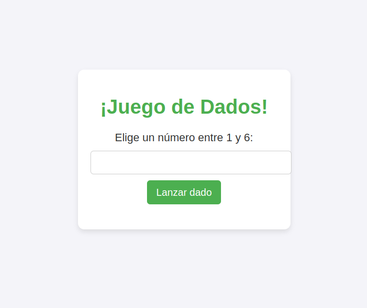

# Juego de Dados

## ¡Bienvenido al juego de dados!

Este proyecto es un sencillo juego de azar desarrollado en PHP. El objetivo del juego es elegir un número del 1 al 6, lanzar un dado, y si el resultado coincide con tu elección ganas.

### Características principales

- Elección de un número entre 1 y 6.
- Simulación del lanzamiento de un dado con resultados aleatorios.
- Mensaje de victoria o derrota.

### Instrucciones de uso

1. Clona este repositorio en tu equipo.
2. Abre el archivo `index.php` en tu navegador.
3. Elige un número del 1 al 6.
4. Haz clic en "Lanzar dado" para ver el resultado.

### Ejemplo de uso

Así se ve el juego:



### Tabla de resultados posibles

| Elección del jugador | Resultado del dado | Estado   |
| -------------------- | ------------------ | -------- |
| 3                    | 3                  | Ganaste  |
| 4                    | 2                  | Perdiste |
| 6                    | 6                  | Ganaste  |

### Código embebido

Aquí tienes un fragmento del código PHP utilizado para el juego:

```php
<?php
// Generar un número aleatorio entre 1 y 6
$resultado = rand(1, 6);

// Número elegido por el jugador
$eleccion = $_POST['numero'] ?? null;

        if ($eleccion) {
            if ($resultado == $eleccion) {
                echo "<div class='result' style='color:green;'>¡Ganaste! El dado mostró $resultado.</div>";
            } else {
                echo "<div class='result' style='color:red;'>Perdiste. Elegiste $eleccion y el dado mostró $resultado.</div>";
            }
        }
?>
